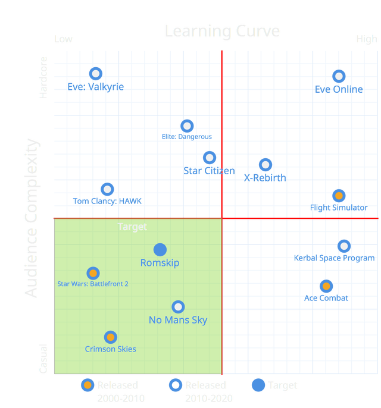
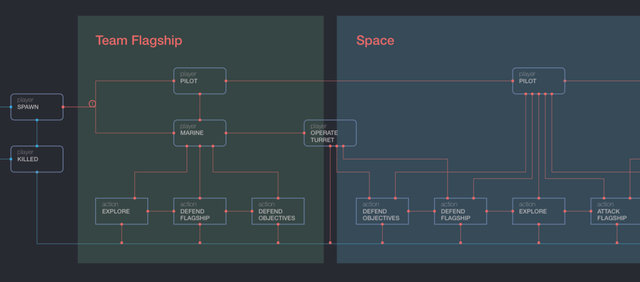

I’m excited today to announce my latest ongoing project, Corsair - a first person vehicular space combat game.

===

I’ve personally always been a fan of science fiction, I remember fondly the first time I watched Star Wars, and how the space battles left me with the urge to recreate them. A few games helped fill that void - like the upcoming Star Citizen and the Halo series, but they didn't quite capture the feeling of power and ease. So as my skills in game design grew, I realised I could finally achieve what had been seemingly and frustratingly out of my teach for a decade and since then I’ve been building up the concept of a space fighter game. Iterating over concepts, to make something that people would want play.

https://vimeo.com/129782094

With Corsair players are put in control of space craft where they can test their combat prowess against each other on a huge scale. What you’re about to see is a quick demonstration of what to expect from the complete game in terms of mechanics:

https://player.vimeo.com/video/129782094

Consisting of multiplayer matches that last between 25-35 minutes, the game is built around a variety of different game modes, with each mode fitting into a general story. In one scenario, players start off on their teams flagships, with the option to either defend their flagship from inside, or take the battle to space in a variety of fighter ships. Players have numerous options for how to play the game.

The design of Corsair is based heavily on competitive products. Many current sci-fi and flight simulation games are aligned to the extremes within their fields. General examples of these games are that they require a huge amount of player investment with players spending large amounts of time and resources to progress through the game at a slow pace. Corsair aims to fix this, with its more simplified controls and themes - condensing down the complicated formulate into smaller and tangible experiences.

Further more, the game lets players use their prefered playstyle. Combining vehicular and FPS combat together, with offensive and defensive environments constructs gameplay motivates the players to cooperate as a team, while still catering to their play styles.

Development for Corsair has so far been a “one-man” job - ambitious for the scale and complexity that I’m aiming for. However, with the progress of development tools such as Unity and focus on modular design, I’ve been able to build up a wealth of assets and achieve some of the crucial core mechanics. As these posts continue I'll go more into depth on the various mechanics, gameplay concepts and executions for Corsair.