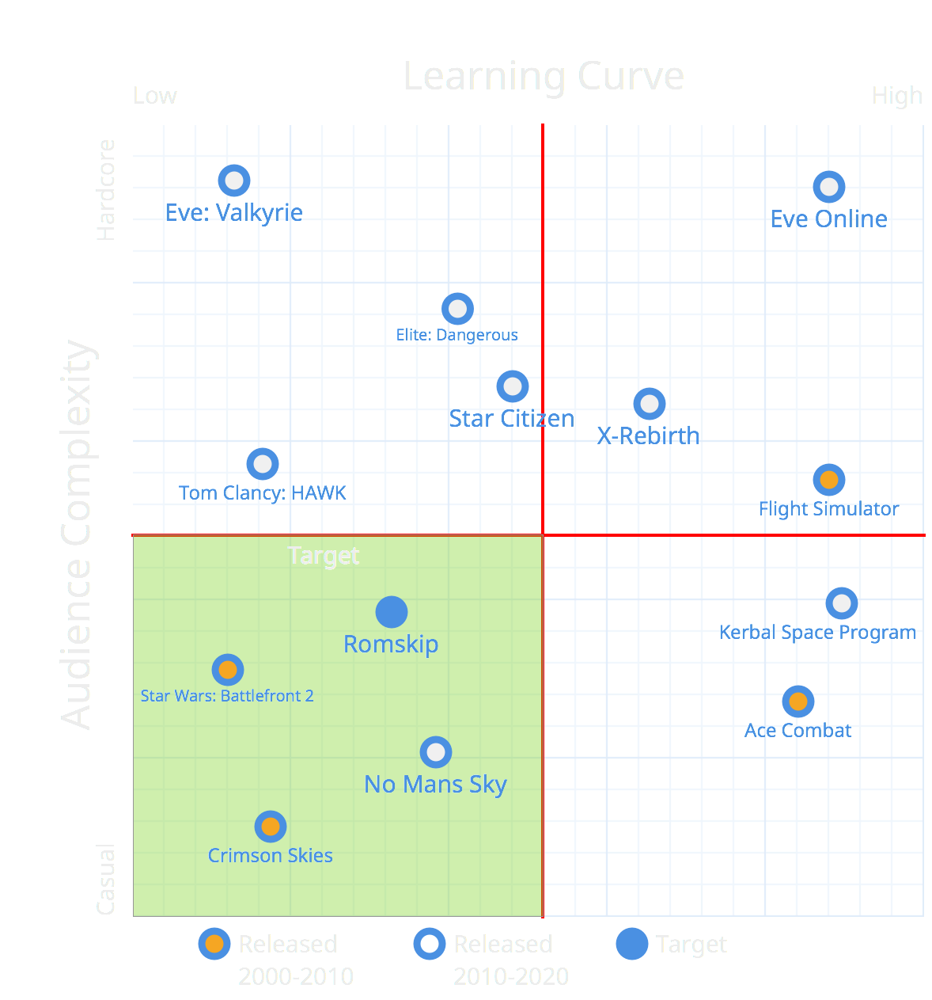

Corsair is a solution to a current entertainment trends within the space and sci-fi genre. There’s a multitude of issues and difficulties with space simulation games, many often requiring a higher barrier of entry in terms of skill and passion to the genre, or complexity and scope. Corsair aims to be a casual entry into the field that players will be able to easily enjoy without large amount of commitment to the game or genre.

> Current flight simulation games are difficult to digest and are overly complex limiting the casual audience. Corsair aims to fix this.

Many current sci-fi and flight simulation games are aligned to the extremes within their fields. General examples of these games are that they require a large amount of player investment with players spending large amounts of time and resources to progress through the game at a slow pace, or they posses a heavy learning curve. These are purposeful within the context of the gameplay, but are severely limiting to the type of players that can enjoy the genre.

In my first blog I briefly touched on the competitive analysis of Corsair compared to other space titles. Games like Flight Simulator require the users to learn what each dial and equipment controls, an example of steep learning curves while EVE online features complex player driven systems, such as a player economy, persistent governmental system, an example of large player commitment to progress. These are examples of the hardcore audience, and while there have been few attempts and even fewer successful solutions to appeal to the casual audiences within these genres, none have been within the last ten years. 

These examples feature a time consuming aspect of gaming, as theres a journey involved. They are not for players who have small portions of time to enjoy games, nor are they for those who like the more focused competitive gameplay. The motivation for playing these games is more on exploration than for an appreciation for vehicular and FPS mechanics. 

Corsair, in comparison is flight simulator with simplified physics and relaxed controls for example takeoffs and landings being completely automated. This is a conscious design to make the game easy to learn, and to place its focus on action instead of the physics of flight. Players won’t be skilled at the game, but they’ll be able to explore and engage quickly and easily.

So with all that in mind I decided that Corsair must target a mixture between people who enjoy vehicular combat games and space fighting games as well as competitive arena styled games. The main goal of the game is to target players who play to experiencing the ‘peak game flow’. Players want to get a rush out of the game, and Corsair provides that with its team based, and MOBA styled arena environments.

* Ages: 16+
* Genders: Open to both Genders, more focused on Males.
* Lifestyle:
** Young teens to middle aged people with a fascination with scifi law.
** Appreciation for FPS shooters with strategy
* Appreciation for vehicular and FPS mechanics
* Interests
* People looking for arena styled combat.
* Peak game flow
* Strategy based gameplay
* Attitude
* Competitive
* Preferences for balanced more strategic gameplay
* Geography and Culture
* Western, UK, United States, Australia
