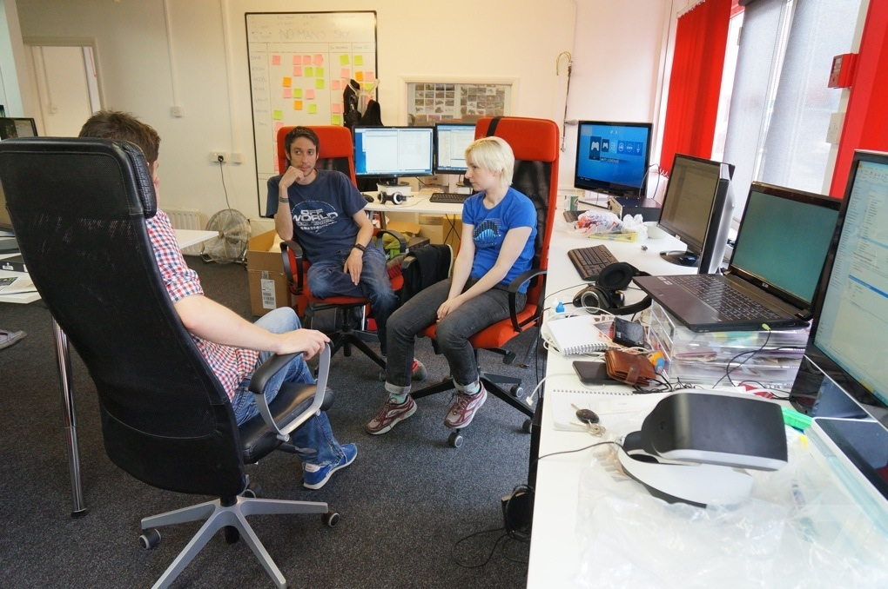

The last five years of game industry has seen radical changes that has shaped the consumers, the publishers, and the attitude of gamers. The largest changes being the democratizing of gaming consumption and creation and groundbreaking business models. As for the future, it’s safe enough to say that the game industry is reaching a new peak of innovation. We are on the fringe of a whole new breed of smaller, more focused a far studios creating smaller AAA games, and we are even having games being made by the gamers themselves.

The cost of developing games has drastically decreased with newer and cheaper tools lowering the overhead of development, and opening up game development to casuals. While much of the gaming industry was built on indie developers in the 1980’s, the complexity and scope of games over the last decade has increased cost and more importantly dependence on publishers. Yet recently, a Danish company called ‘Unity Technologies’ recently released their own development toolkit to the masses, with a tiered licensure system starting free. Their reasoning is simple, believing that for the industry to grow it should be able to support the smallest of developers. They are not the only ones, with Crytek and Epic studios releasing their once internal tools to the masses as well.

Over the last few years many well established industry leaders have split away from their safe AAA studios to create the games they have dreamt of. A prime example of this exodus is Ken Levine, who killed of his 300+ company to create a team of 6 developers and Peter Molyneux, who recently left his position at Microsoft to create a new incredibly small publisher free studio. Both openly believe that with the newer revenue options studios can be built to entirely support a smaller more personally invested games, much like Molyneux doing with startup 22cans. Game designers will be able to create the games they imagine and love without the risks and cost of large investments and overhead. Basically, with the gateway of publishing slowly diminishing entire small studios can be set up to support small, rapidly developed games with or without publishers. 

We’re also seeing games being made in games. Microsoft Studios recently announced a new Xbox Game called ‘Project Spark’, which gives players the ability to create their own game from the ground up. Using Kinect players can animate models and record audio, shape landscapes and build whole new ways to interact with the game that even the current developers can’t predict. NEXT SLIDE The last five years of game industry has seen radical changes, with a large shift in how games are being created. While it is impossible to truly predict what will happen in the future, I can strongly see new and smaller studios forming with professional game developers and indies. In the future, we could see the end of game studios as we know them today. Instead of studios creating games for a target audience of gamers, we’re going to see gamers creating the games they want see.

*Extract from a speech given at SCAD Hong Kong, 2014 by Keiran Lovett. Image, Hello Games Studio taken by Vlad Savov of Polygon.*