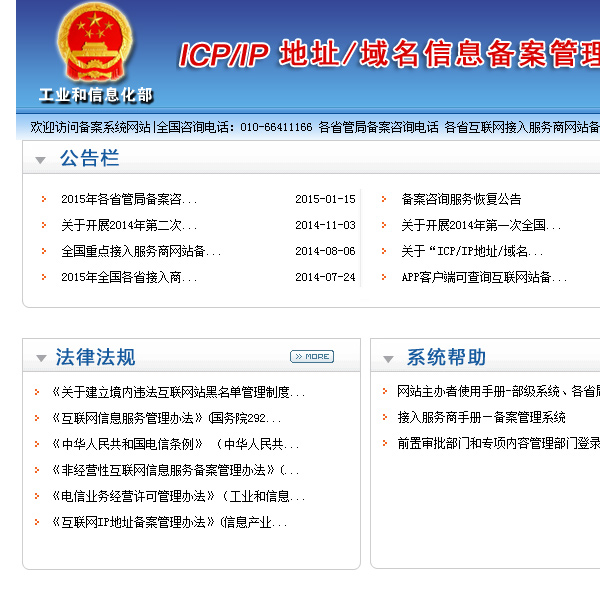

In June 2016, the Chinese government&#39;s censorship body [SAPPRFT](https://en.wikipedia.org/wiki/State_Administration_of_Press,_Publication,_Radio,_Film_and_Television) announced some big changes for mobile game publishing in China. Starting July 1, 2016, every game will require pre-approval in order to be published on the Chinese market.

While independent developers can handle the approval process on their own, the process may end up paying third-party firms over $5,000USD.

Launching a foreign-developed mobile game in China is impossible without a Chinese publishing partner, as foreign entities, WFOEs, and JVs are prohibited from engaging in online publication activities. Chinese laws and regulations require foreign developers or publishers to engage a qualified Chinese publishing entity to handle and take full responsibility for governmental approvals, game distribution and operation as well as the collection of payments (only Chinese entities are able to receive payment) and user data.

List of approved games: [http://www.gapp.gov.cn/govservice/1980.shtml](http://www.gapp.gov.cn/govservice/1980.shtml)

Process:

The SAPPRFT has publication requirements with different approval processes for three categories of games:
1. Simple games 
  - TIME FOR APPROVAL: At least 20 working days
  1. Do not have any political, military, national, or religious content
  2. Game plot is very simple or game has no storyline
  3. Domestic game classified as match-3, endless runner, flying, chess, puzzle, sports, dance, music, or similar genre
2. Other domestic mobile games
  - TIME FOR APPROVAL: 3 Months
3. Foreign mobile games 
  - TIME FOR APPROVAL: Unspecified, but more than 3 months

All games must not have anything that:
- violates China&#39;s constitution
- violates China&#39;s policy on religion by promoting cults or superstitions.
- threatens China&#39;s national unity, sovereignty, or territorial integrity.
- harms public ethics or China&#39;s culture and traditions.
- harms the nation&#39;s reputation, security, or interests.
- instigates racial/ethnic hatred, or harms ethnic traditions and cultures or otherwise insults, slanders, or violates the rights of others.
- promotes or incites obscenity, drug use, violence, or gambling.

### App Checklist: 
In order to get your game approved you will need to submit your game at least 20 days or 100 days prior to launch (depending on the process category), with an estimated 7 working days for auditor assessment, upon personal approval, auditor will then send a written letter of recommendation to the SAPPRFT office who will make a final approval, taking an additional 10 working days, before the notification process which averages 3-5 working days.

Within 7 days of the game launch you have to contact SAPPRFT again to report details on the launch of the game, such as the launch date, which app stores it is on and other. If you fail to launch within 20 days of approval then you also have to contact SAPPRFT with a statement indicating the causes.

### Requirements:

- **Online Publishing Service License** (&quot;Online Publishing License&quot;, 网络出版服务许可)
  - [Legal - Online Publishing Rules](https://chinacopyrightandmedia.wordpress.com/2016/02/04/online-publishing-service-management-rules/)
  - Any business that engages in online publishing must obtain from the SAPPRFT before commencing operation. With online gaming, the Regulations require, including domain names, onshore servers, technical equipment and applications for mobile devices. The legal representative must be a Chinese citizen who is residing in China. At least one of the two must have the Intermediate Professional Qualification for Publishing (&quot;IPQP&quot;, &quot;中级出版专业技术人员职业资格&quot;) or above. In addition, the business must maintain at least eight full-time editing staff. All the staff must hold qualifying certificates recognized by the SAPPRFT, among whom three must hold IPQP or above  and any changes to the organizational structure and scope of operations must be reported.
  - Once the license is issued, operations must commence within 180 days.
  - Online game publishing scope granted by the SAPPRFT.
  - Valid for five years and can be extended upon application.

- **Public Security Bureau (PSB) Filing**:
  -TIME FOR APPROVAL: At least 20 working days
  - [Link](http://www.beian.gov.cn/portal/index?spm=a3c0i.q43898en.a3.1.4m8KY8)
  - You will need to submit a PSB application after an ICP Filing or Commercial ICP License application, within 30 days of your website / game going live.

- **ICP (Internet Content Provider) License**:
  - TIME FOR APPROVAL: At least 20 working days
  - Links
      - [MIIT Filing Requirements](http://www.miitbeian.gov.cn/state/outPortal/loginPortal.action;jsessionid=KPbfWlNZn7VxKgctVTzTpv2hLh81Tq0G23FJdnNLGzGyQnqJfqxl!-888526095)
      - [Alibaba Cloud Filing Guide](http://beian.aliyun.com/)
  - A state-issued registration number that allows you to host your website on a mainland Chinese server, there are two variants the ICP Beian License (ICP备案) also referred to as an &#39;ICP filling&#39; (which you must obtain when launching a website that is hosted in mainland China), and the Commercial ICP License &#39;ICP Zheng&#39;  (ICP经营许可证) and should be submitted to the provincial government branches as each MIIT branch has its own regulations. Foreign businesses with no legal business presence in China OR Foreign individuals without a passport (and who are therefore ideally not residing in China) cannot apply.
        - The ICP Beian License is needed for all types of websites. If your website has &quot;commercial&quot; activities, you will be required to also get a valid Commercial ICP License.
          - Chinese-owned businesses with a Chinese business license OR partially or wholly foreign-owned (non-Chinese) businesses with any type of Chinese business license (Joint-Venture or WOFE, for example) can apply for a Business ICP (企业备案). Businesses registering for an ICP license must register in the province their business license was issued in.
          - Chinese nationals, using their state-issued ID OR Foreign (non-Chinese) individuals, using their passport as ID, who can be physically present in China long enough to fulfill some basic registration requirements can apply for an Individual ICP.
      - ICP Commercial License allows online platforms or third-party sellers of goods and services to deploy their website on a hosting server or CDN within Mainland China
  - Requirements (documents you should submit to your hosting provider):
      - Legal Representative Information and ID/Passport Scan
      - Webmaster Information and ID Scan (Chinese Contact)
      - Company Business License Scan
      - ICP Beian Application
      - Photo of Legal Representative or Webmaster (taken in front of a poster from your hosting provider)
      - Domain Certificate or WHOIS information
      - yourdomain.com and all other sub-domains do not have content

- **Smartphone** 
     - Devices with the game pre-installed, including an active sim card and data plan OR an APK file which they will download and install on a test phone (though more prone to failure).
