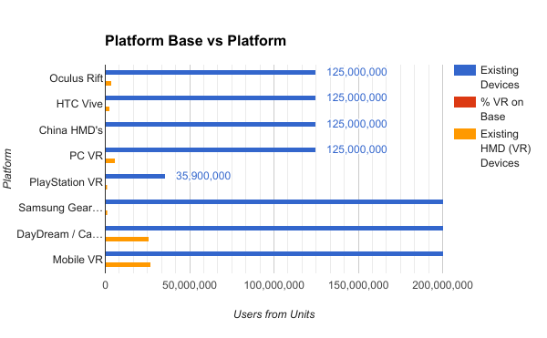

We wanted to quickly get a benchmark of the VR industry to see potential areas of growth and possible cost / benefits of developing games for the various platforms. 

The below used various sources of official and speculated data to help get a better guage on the profits globally and within China.

<iframe src="https://docs.google.com/spreadsheets/d/1b7wf3xSlpPEhs2q8WQ1BMWqRG6w_02I3hU8UW73Z76Q/pubhtml?widget=true&amp;headers=false" width="100%" height="600px"></iframe>

Due to the difficulty of obtaining VR hardware and space in China, naturally mobile was the only sensible and economic direction.