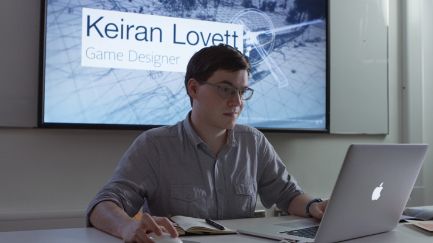
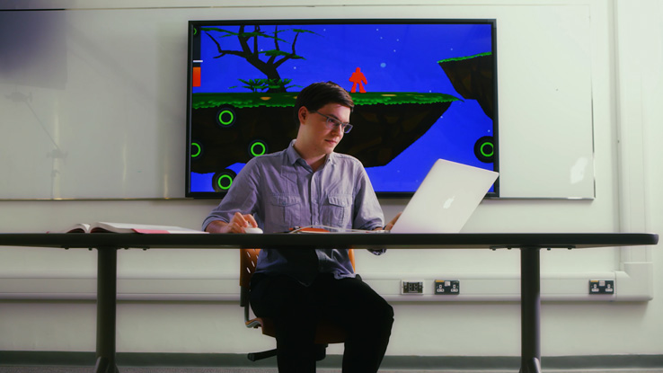

I'm happy to showcase my small contribution to Brand HK's latest campaign "Creative Hong Kong", in their latest video "Wall to Wall Creativity" I showcase a small game I designed while a student at Savannah College of Art and Design Hong Kong.



You can check out the [article here](http://www.brandhk.gov.hk/html/en/OurHongKong/creativehkgameon.html), or read the excerpt below.

===

Our latest video "Wall to wall Creativity" features home-grown talent, including online game designer Keiran Lovett.

When looking for a suitable young "star" in the fast-developing on-line game sector, we asked The Savannah College of Art and Design (SCAD) for help. SCAD positions itself as the “University for Creative Careers” in Hong Kong and prepares talented students for professional careers in the fields of art and design. That includes alumni Keiran, whose gaming design work features in our video and who now works as a game developer for a well-known entertainment and F&B group.
 
Keiran came to Hong Kong when he was 12, is now a permanent resident, and has a B.F.A in Design and Game Management from SCADHK. Thanks guys!

