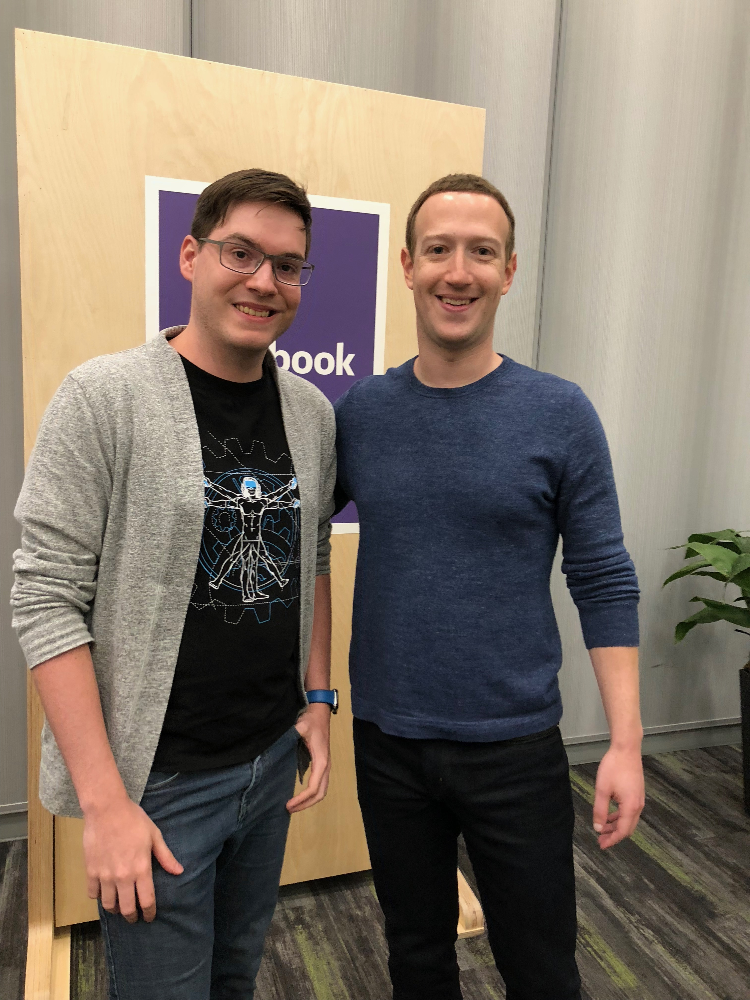

## My Journey to F8: A Personal Take on Innovation at Facebook  

I’ve just returned from F8, Facebook’s annual developer conference, where I had the opportunity to represent Shadow Factory. When I first heard I’d be going, I was equal parts excited and curious. Shadow Factory has been steadily building content across AR and VR, particularly through our work as an early partner on Facebook’s *Spark AR* platform. The invitation to the McEnery Convention Center in San Jose felt like recognition of the progress we’ve made. Over the course of four days, I had the chance to meet fellow AR developers, engage with the Facebook team, and sit in on talks about the future of AR and VR.  

## The Power of Spark AR and the AR Community  

For the uninitiated, *Spark AR* is Facebook’s augmented reality platform that enables creators to design interactive AR experiences for Facebook. Its intuitive node-based interface makes complex AR creation far more accessible, reducing the need for advanced coding. This simplicity is why I championed its adoption at Shadow Factory—it allowed us to deliver high-quality, interactive AR content quickly for clients across established platforms.  

At F8, however, the platform’s full potential came into sharper focus. *Spark AR* isn’t just about filters or playful effects; it’s a tool poised to redefine how people engage with content, brands, and each other. A key takeaway from the sessions I attended was Facebook’s commitment to accessibility. Their roadmap focuses on lowering technical barriers even further, enabling anyone—not just developers—to create AR experiences. This philosophy has massive implications.  

Imagine users crafting AR content for brands or customizing effects to suit their personal stories, effectively becoming unofficial brand ambassadors. On the flip side, this democratization raises a serious question: *What’s the role of agencies like Shadow Factory when anyone can create AR?* It’s a double-edged sword. While user-generated content can spark creativity and authenticity, it also creates a flood of material where standing out requires not just technical skill but strategic vision. The challenge isn’t just about adapting—it’s about thriving in an environment where quality must rise above quantity.  

### A Conversation with Mark Zuckerberg  

One of the most surreal moments at F8 was sitting down with Mark Zuckerberg himself. Despite his towering influence, I was struck by how approachable and attentive he was. He didn’t just listen; he engaged with genuine interest and a nuanced understanding of the topics at hand.  

Our conversation centered on *Spark AR’s* potential to empower user-generated content. Zuckerberg spoke about AR as a medium for individuals to reshape their digital environments and narratives, blending live overlays with physical spaces. We also touched on AR’s broader applications, particularly its role in creating persistent, immersive digital spaces. Zuckerberg emphasized accessibility, reiterating the importance of giving everyone the tools to tell their stories. What stood out most wasn’t the pitch for the platform but the ethos behind it: AR as a connector of people, ideas, and shared experiences.  

So for all the inspiration, it’s hard to ignore the practical challenges this raises I think. Democratization may be great long term, but it inevitably dilutes the exclusivity agencies rely on to differentiate their work. For us its clear the path forward means embracing this shift while doubling down on expertise that mass accessibility cannot replicate: depth, polish, and purpose-driven storytelling.  

### The Takeaway: Building for the Future  

Leaving F8, Oculus Go headset in hand (a perk worth mentioning), I felt both inspired and a little uneasy. Facebook’s vision for AR isn’t just about expanding technical possibilities—it’s about reshaping the creative landscape entirely.

This vision raises critical questions that will define the future of AR. What happens when AR creation becomes ubiquitous? How can agencies like ours maintain relevance in a crowded, democratized space? And most importantly, how do we ensure that storytelling remains central in the face of overwhelming content volume?

Looking ahead, the AR space is poised for transformation. User-generated content will dominate, becoming a powerful force for education, commerce, and community-building—not just entertainment. This shift will redefine what success looks like for creators and agencies. It will no longer be about technical prowess or quick turnarounds alone, but about delivering emotionally resonant experiences that stand out through originality and depth.

F8 wasn’t just a glimpse into Facebook’s roadmap; it was a sign of what’s coming for all of us. AR will evolve into a space where accessibility is paramount, where tools empower anyone to create. But for agencies like Shadow Factory, the challenge—and the opportunity—is clear: to lead, not by competing with the sheer volume of user-generated content, but by elevating storytelling. Crafting impactful, purposeful narratives will remain the differentiator that keeps professional creators at the forefront of this rapidly shifting landscape.

